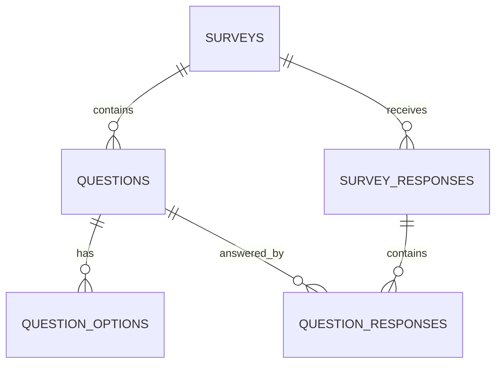

# Database Schema - Survey System

## Overview
Simple relational model supporting survey creation, response collection, and results aggregation.

## Core Tables

### 1. surveys
```sql
CREATE TABLE IF NOT EXISTS surveys (
    id INT PRIMARY KEY AUTO_INCREMENT,
    title VARCHAR(255) NOT NULL,
    description TEXT,
    status ENUM('draft', 'active', 'closed') DEFAULT 'draft',
    created_at TIMESTAMP DEFAULT CURRENT_TIMESTAMP,
    updated_at TIMESTAMP DEFAULT CURRENT_TIMESTAMP ON UPDATE CURRENT_TIMESTAMP,
    
    INDEX idx_status (status),
    INDEX idx_created_at (created_at)
);
```

**Purpose**: Stores survey metadata and status information.

### 2. questions
```sql
CREATE TABLE IF NOT EXISTS questions (
    id INT PRIMARY KEY AUTO_INCREMENT,
    survey_id INT NOT NULL,
    question_text TEXT NOT NULL,
    question_type ENUM('single_choice', 'multiple_choice') DEFAULT 'single_choice',
    is_required BOOLEAN DEFAULT TRUE,
    order_position INT NOT NULL DEFAULT 0,
    created_at TIMESTAMP DEFAULT CURRENT_TIMESTAMP,
    
    FOREIGN KEY (survey_id) REFERENCES surveys(id) ON DELETE CASCADE,
    INDEX idx_survey_order (survey_id, order_position)
);
```

**Purpose**: Stores survey questions with type and validation rules.

### 3. question_options
```sql
CREATE TABLE IF NOT EXISTS question_options (
    id INT PRIMARY KEY AUTO_INCREMENT,
    question_id INT NOT NULL,
    option_text VARCHAR(500) NOT NULL,
    order_position INT NOT NULL DEFAULT 0,
    created_at TIMESTAMP DEFAULT CURRENT_TIMESTAMP,
    
    FOREIGN KEY (question_id) REFERENCES questions(id) ON DELETE CASCADE,
    INDEX idx_question_order (question_id, order_position)
);
```

**Purpose**: Stores multiple choice options for questions.

### 4. survey_responses
```sql
CREATE TABLE IF NOT EXISTS survey_responses (
    id INT PRIMARY KEY AUTO_INCREMENT,
    survey_id INT NOT NULL,
    user_id INT NOT NULL,
    submitted_at TIMESTAMP DEFAULT CURRENT_TIMESTAMP,
    ip_address VARCHAR(45) NULL,
    
    FOREIGN KEY (survey_id) REFERENCES surveys(id) ON DELETE CASCADE,
    UNIQUE KEY unique_user_survey (user_id, survey_id),
    INDEX idx_survey_submitted (survey_id, submitted_at)
);
```

**Purpose**: Tracks survey responses with one response per user per survey constraint.

### 5. question_responses
```sql
CREATE TABLE IF NOT EXISTS question_responses (
    id INT PRIMARY KEY AUTO_INCREMENT,
    survey_response_id INT NOT NULL,
    question_id INT NOT NULL,
    selected_option_ids JSON NULL,
    other_text TEXT NULL,
    text_response TEXT NULL,
    file_path VARCHAR(500) NULL,
    created_at TIMESTAMP DEFAULT CURRENT_TIMESTAMP,
    
    FOREIGN KEY (survey_response_id) REFERENCES survey_responses(id) ON DELETE CASCADE,
    FOREIGN KEY (question_id) REFERENCES questions(id) ON DELETE CASCADE,
    INDEX idx_survey_response (survey_response_id),
    INDEX idx_question (question_id)
);
```

**Purpose**: Stores individual question responses with support for different question types.

## Entity Relationships


