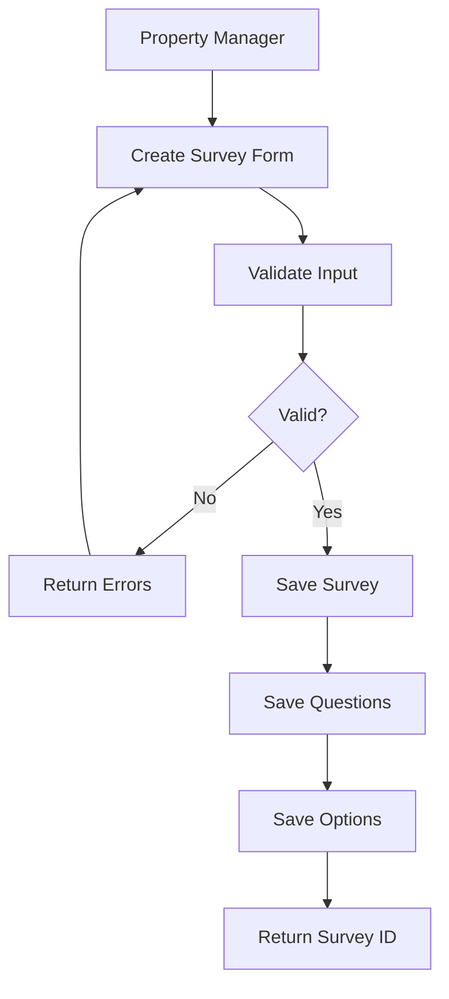
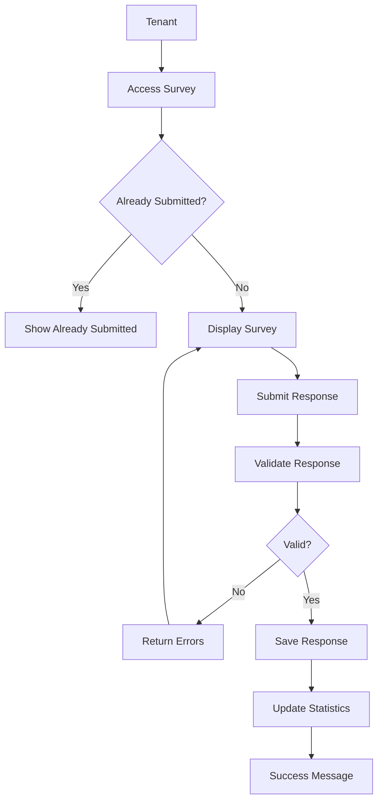
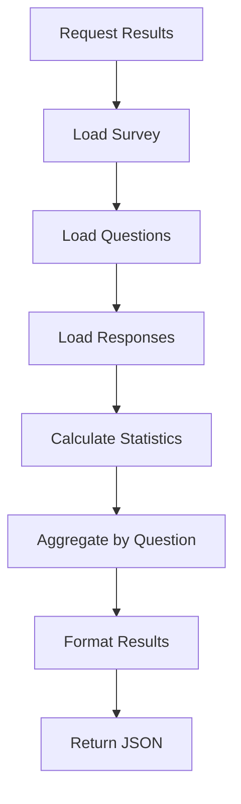
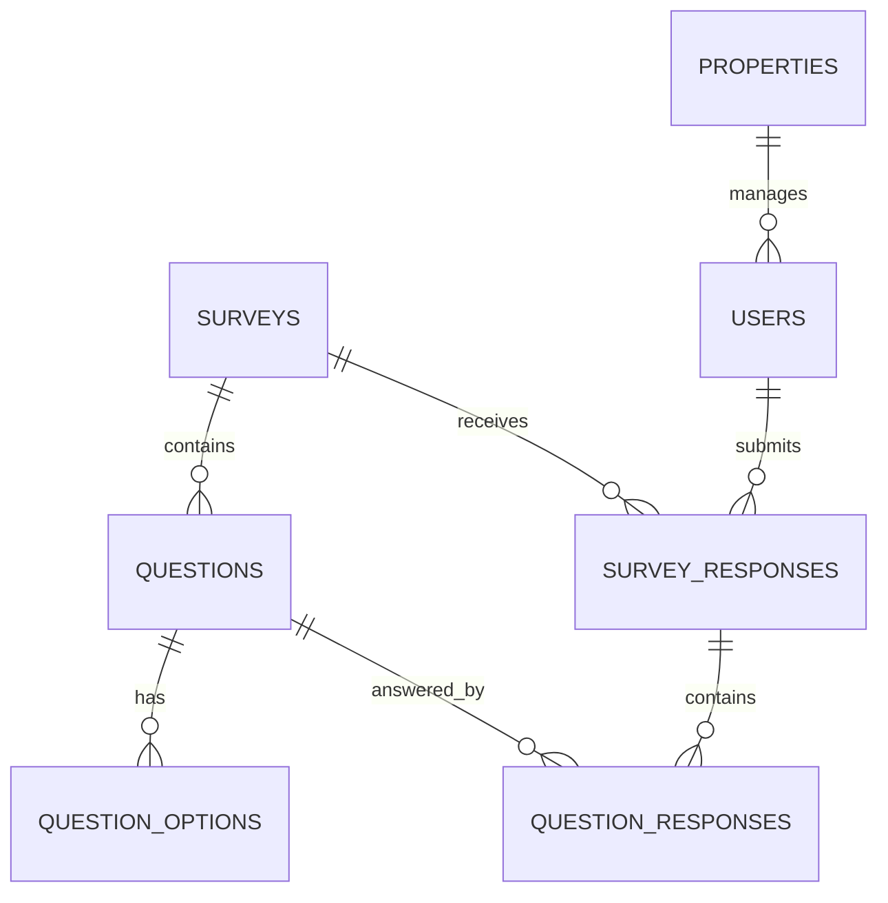

# Survey System - Design Document

## Overview
A PHP/Symfony-based survey system for property management companies to collect tenant feedback through customizable surveys with multiple question types.

## System Architecture

### High-Level Architecture
```
┌─────────────────┐    ┌─────────────────┐    ┌─────────────────┐
│   Frontend      │    │   REST API      │    │   Database      │
│   (React/Vue)   │◄──►│   (Symfony)     │◄──►│   (MySQL)       │
└─────────────────┘    └─────────────────┘    └─────────────────┘
                              │
                       ┌─────────────────┐
                       │   Services      │
                       │   Layer         │
                       └─────────────────┘
```

### Technology Stack
- **Backend**: PHP 8.3, Symfony 7.3
- **Database**: PostgreSQL 16
- **ORM**: Doctrine 2
- **API**: RESTful JSON API
- **Frontend**: JavaScript/HTML (TODO)

## Core Features

### 1. Survey Management
- Create surveys with multiple question types
- Support for single choice, multiple choice, text (TODO), and file upload (TODO) questions
- Survey scheduling (start/end dates)
- Survey status management (draft → active → closed)

### 2. Response Collection
- One response per tenant per survey
- Anonymous response support (TODO)
- IP tracking for anonymous surveys (TODO)

### 3. Results Collection
- Aggregated results with statistics

## Data Flow Diagrams

### Survey Creation Flow


### Survey Response Flow


### Results Generation Flow


## Database Design

### Entity Relationships


### Key Tables
- **surveys**: Core survey information
- **questions**: Survey questions with types
- **question_options**: Multiple choice options
- **survey_responses**: Survey responses
- **question_responses**: Individual question answers
- **users**: Tenants and property managers (TODO)
- **properties**: Multi-tenancy support (TODO)

## API Design

### RESTful Endpoints
```
POST   /api/surveys                # Create survey
GET    /api/surveys                # List surveys
GET    /api/surveys/{id}           # Get survey details
POST   /api/surveys/{id}           # Submit response
GET    /api/surveys/{id}/responses # Get results
PUT    /api/surveys/{id}/status    # Update status
```

## Security & Validation

### Authentication (TODO)
- Bearer token authentication
- Role-based access control

### Validation Rules
- Survey: Title (3-255 chars), description (max 1000 chars)
- Questions: Text (5-500 chars), at least one per survey
- Options: Text (max 500 chars), at least one per MC question
- Responses: One per user per survey, required field validation

### Business Rules
- End date must be after start date
- Single choice: exactly one option
- Multiple choice: at least one option
- Survey must be active for responses
- "Other" option requires text input (TODO)

## Scalability Considerations

### Performance (TODO)
- Pagination for large datasets
- Caching for survey results 

### Extensibility (TODO)
- Question type strategy pattern
- Plugin system for custom question types

## Testing Strategy (TODO)

### Unit Tests
- Entity validation
- Service layer business logic

### Integration Tests
- API endpoint functionality
- Authentication flows

### End-to-End Tests
- Complete survey workflow
- Response submission
- Results generation
